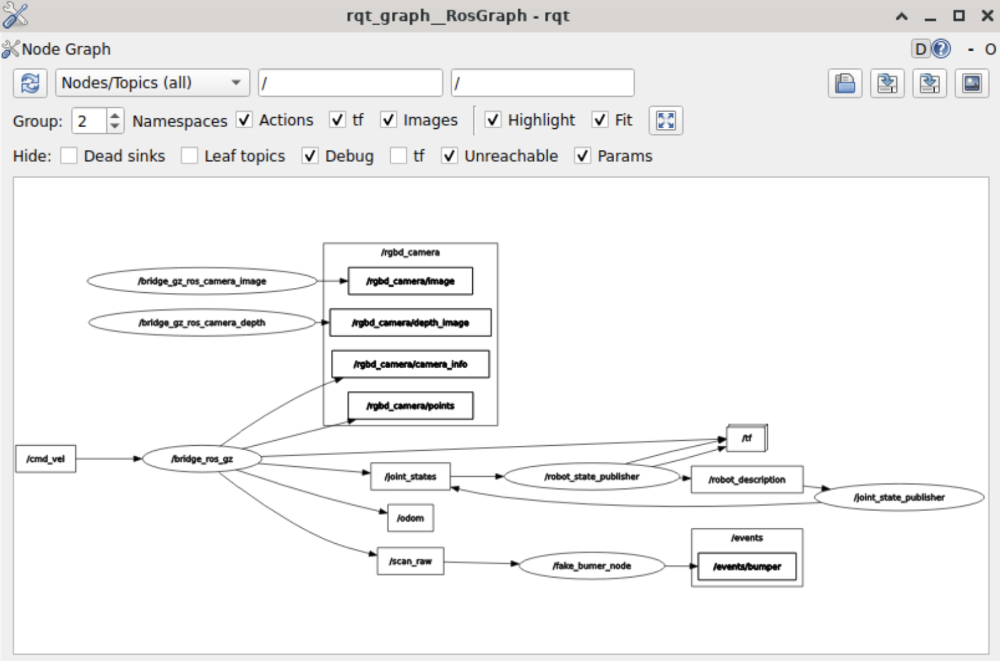

# Introducción a ROS 2 como usuario

ROS (Robot Operating System) es un conjunto de bibliotecas y herramientas para ayudar a los desarrolladores de software crear aplicaciones robóticas. Proporciona una abstracción del hardware, de los controladores de dispositivos, las bibliotecas, visualizadores, paso de mensajes, gestión de paquetes y mucho más.

Ya habéis utilizado ROS en la asignatura de Programación de Robots así que nos limitaremos a dar un breve repaso de los conceptos en que se basa, sin explicarlos en profundidad.

A continuación veremos cómo ejecutar programas ROS en los simuladores y cómo funcionan los nodos y topics de ROS. De momento no veremos cómo programar en ROS ya que lo dejamos para otros apuntes, por eso a estos los hemos llamado "introducción como usuario".

Durante el curso usaremos sobre todo ROS 2, en concreto la versión "Jazzy". Desde hace un tiempo lo que podríamos llamar ROS1 está descontinuado y ya no se ofrece soporte para él. En los últimos años la comunidad ha ido migrando hacia ROS2, motivo por el que lo usaremos en la asignatura. 


> Por lo que yo sé, en la asignatura de Programación de Robots habéis usado tanto ROS1 como ROS2, centrándoos en el primero. No obstante como ya habréis visto los conceptos básicos (topics, nodos, paquetes, ...) se mantienen y las diferencias se centran sobre todo en las herramientas de desarrollo, las herramientas en línea de comandos y el API de programación.

## Conceptos básicos

- Tópico (*topic*): Son canales de información entre los nodos. Un nodo puede emitir o suscribirse a un tópico. Por ejemplo, ña base del robot suele emitir un tópico que es la odometría del robot. Cualquier nodo se puede suscribir. El nodo que emite no controla quién está suscrito. La información es, por tanto, unidireccional (asíncrona). Si lo que queremos es una comunicación síncrona (petición/respuesta) debemos usar servicios. Un tópico no es más que un mensaje que se envía. Podemos usar distintos tipos de clases de mensajes.
- Paquete (*package*): El software en ROS está organizado en paquetes. Un paquete puede contener un nodo, una librería, conjunto de datos, o cualquier cosa que pueda constituir un módulo. Los paquetes pueden organizarse en pilas (stacks).
- Nodo (*node*): Un nodo es un proceso que realiza algún tipo de computación en el sistema. Los nodos se combinan dentro de un grafo, compartiendo información entre ellos, para crear ejecuciones complejas. Un nodo puede controlar un sensor láser, otro los motores de un robot y otro la construcción de mapas.
- Pila (*stack*): Conjunto de nodos que juntos proporcionan alguna funcionalidad. Por ejemplo, la *pila de navegación* sirve para que el robot pueda moverse a un punto del mapa por la ruta más corta y evitando obstáculos por el camino.


## Probando un robot en el simulador 

Probar una aplicación por primera vez en un robot real suele ser problemático, ya que depurar el código es complicado y además el  robot podría sufrir daños si el código no funciona correctamente . Por eso la práctica habitual es probar el código primero en un simulador y luego trasladarlo al robot real cuando estamos razonablemente seguros de que va a funcionar.

ROS 2 está integrado con diversos simuladores. En la asignatura usaremos dos distintos:

- **Gazebo**: es un simulador multirobot de entornos 3D,  bastante realista, aunque también consume muchos recursos computacionales y tiende a funcionar lento (o a no funcionar) en máquinas virtuales.
- **Mvsim**: es un simulador que no es totalmente 3D, ya que tiene ciertas limitaciones (por ejemplo el robot no puede subir por rampas). A cambio es mucho más ligero y os lo recomendamos si vuestra máquina no funciona bien con Gazebo.


> En los ordenadores de los laboratorios de momento está solo instalado Gazebo, por lo que es el que usaremos para esta primera sesión.


## Nodos y topics

Como sabéis, los nodos son programas que publican/reciben mensajes en "topics" para comunicarse con otros nodos. Un topic es literalmente un "tema" o "tipo" de mensaje,  pero también podemos verlo como una "cola de mensajes". 

Todo el código (Python/C++) que usemos o programemos nosotros mismos para controlar nuestros robots lo dividiremos en nodos. ROS nos da bastante libertad a la hora de estructurar el código, de manera podríamos programar una tarea compleja (como empujar un balón a una portería para marcar gol) en un solo nodo o dividirla en varios (uno que le siga la pista visualmente a la portería y calcule distancia y ángulo, otro que le siga la pista a la pelota, otro que en función de toda esta información controle la velocidad lineal y angular del robot,...).

### Arrancando la simulación

> Para lo siguiente asumimos que tenemos instalado ROS2 con los paquetes de Turtlebot 2. Está instalado en los PCs del laboratorio y también en la máquina virtual que os dejamos en moodle.

> Recordad que **para ejecutar cualquier comando de ROS en una nueva terminal hay que hacer un "source" del fichero de configuración de ROS, en nuestro caso ejecutar `source /opt/ros/jazzy/setup.bash`**. Si abres otra terminal o solapa de terminal tendrás que hacerlo de nuevo, al menos en los ordenadores del laboratorio. Es posible que si usas tu propia instalación de ROS2 esta orden ya esté incluida en el `.bashrc` y no sea necesaria (puedes revisarlo abriendo el archivo, que debería estar en tu directorio HOME y revisando si incluye la orden).

Para arrancar en ROS2 la simulación de Turtlebot 2 en Gazebo, escribir en una terminal (recuerda hacer antes `source /opt/ros/jazzy/setup.bash`):

```bash
#desde el directorio HOME. Los paquetes para Turtlebot 2 están compilados en el workspace ros2_ws, por eso primero hay que hacer el source
source ros2_ws/install/setup.bash
ros2 launch kobuki simulation.launch.py
```

Pasados unos segundos (Gazebo suele ser lento de arrancar) aparecerá una casa con varias habitaciones donde hay un Turtlebot 2 como los del laboratorio.

### Viendo topics en modo texto

Los robots perciben el entorno, sea real o simulado, a través de sus *sensores*. Como todo en ROS, la información de los sensores es accesible a través de ciertos *topics* en los que el simulador o el robot real publica la información. Abre una terminal aparte (para que el simulador siga ejecutándose en la anterior) y escribe:

```bash
#recuerda que esto siempre hay que hacerlo en una nueva terminal
source /opt/ros/jazzy/setup.bash
ros2 topic list
```
Veremos una lista de *topics* publicados. Por ejemplo `/odom` es la odometría del robot, un sensor que nos dice en qué coordenadas se encuentra con respecto al punto inicial del que partió. Como todavía el robot no se ha movido, si imprimes los mensajes de este *topic* deben indicar que está en la posición "cero". En concreto, los mensajes `nav_msgs/msg/Odometry` incluyen pose (posición y orientación como cuaternión) y twist (velocidades). Al inicio, los valores estarán cercanos a cero. Pruébalo con:

```bash
#con el --once imprimimos solo un mensaje 
#para que no esté imprimiendo continuamente (en /odom se publica varias veces por segundo)
ros2 topic echo /odom --once
```
### Viendo el  grafo de nodos con `rqt_graph`

Para ver la información de modo gráfico puedes usar la orden `rqt_graph`. Pruébala, verás que por defecto aparecen pocos nodos y desconectados, para que aparezca el resto como en la siguiente figura tendrás que:

- En el desplegable donde pone `Nodes only` cambiarlo por `Nodes/topics (all)` y darle al botón de recargar (con la flecha circular) 
- En la opción de `Hide` desmarcar las casillas `Dead sinks` y `Leaf Topics`, así puedes ver los nodos que reciben pero no publican mensajes y los que publican pero no reciben, respectivamente



### Publicando *topics* manualmente

En el grafo de nodos y *topics* habrás visto un *topic* llamado `/cmd_vel`. En este *topic* están escuchando los "motores" del robot, y si publicamos en él estaremos por tanto moviéndolo. En la terminal ejecuta:

```bash
ros2 topic info /cmd_vel
```
Para ver de qué tipo es el *topic*. Verás que nos dice de qué tipo es el mensaje, cuántos nodos publican en él y cuántos están suscritos.si quieres ver información más detallada puedes añadir el parámetro `--verbose`. En ROS hay una serie de tipos de mensajes predefinidos y también  el programador se puede definir los suyos propios. En nuestro caso el tipo es `geometry_msgs/msg/Twist`. Ahora para ver información sobre qué datos componen un mensaje de ese tipo, escribe en la terminal:

```bash
ros2 interface show geometry_msgs/msg/Twist
```

verás que te dice que un mensaje de este tipo está compuesto de 2 vectores 3D con componentes llamados `x`, `y`, `z`. El primer vector se llama `linear` y representa la velocidad lineal y el segundo `angular` y como es lógico representa la velocidad angular.

Podemos mover al robot publicando mensajes de manera manual, aunque es engorroso. Prueba:

```bash
ros2 topic pub --once /cmd_vel geometry_msgs/msg/Twist  "{linear:  {x: 0.2, y: 0.0, z: 0.0}, angular: {x: 0.0, y: 0.0, z: 0.0}}"
```

El comando anterior habrá publicado un único mensaje en el que ponemos al robot a moverse hacia adelante (eje x) a 0.2 m/s. En el caso del controlador del Turtlebot 2 que estamos usando, basta con publicar un único mensaje para mantener la velocidad constante. Así que tendrás que publicar otro mensaje con velocidad x:0 si quieres pararlo. En otros controladores hay que publicar el mensaje varias veces por segundo para mantener al robot moviéndose, y si dejas de publicarlos el robot se para automáticamente. En ese caso se usa el parámetro `-r` para especificar las veces por segundo que queremos publicarlo.

### Viendo topics en modo gráfico

Entre los topics que publica el simulador, `/scan_raw` es el sensor de rango del robot. Da las distancias a los objetos más cercanos en este caso en 360 grados (aunque los laser que tenemos en los Turtlebot del laboratorio tienen un campo de visión aproximado de unos 240 grados). Podemos ver la información en modo numérico en la terminal con 

```bash
ros2 topic echo /scan_raw --once
```

No obstante, ver impresa la lista de números con las distancias no es muy intuitivo. En general es mucho mejor visualizar la información de los sensores en modo gráfico. Para ello disponemos en ROS de la herramienta `rviz`, que en ROS2 se llama `rviz2`.

```bash
ros2 run rviz2 rviz2
```

Al entrar en `rviz` lo primero es **cambiar en el panel izquierdo, en las `Global Options`, la opción `fixed frame`**. Este es el sistema de coordenadas que usará `rviz` para dibujar. Ahora está puesto a `map` y da un error porque eso sería para un mapa construido por el robot, cosa que no se ha hecho (lo haremos en una práctica posterior). Lo podéis cambiar por cualquiera de las otras opciones que sale al seleccionar el desplegable a la derecha de `fixed frame`, por ejemplo `odom`.

Podemos visualizar el sensor de rango añadiendo un nuevo *display* de tipo *LaserScan* (botón `Add` de la parte inferior del panel izquierdo). Una vez añadido hay que cambiar la opción `topic` para que se corresponda con el que está publicando el robot, en este caso `/scan_raw`. Debería aparecer dibujado en rojo el entorno que rodea al robot.

> Dado que ambas herramientas muestran información gráfica es fácil confundirse con el papel que desempeñan Gazebo y rviz. Como hemos dicho, Gazebo es un simulador y rviz un visor de los sensores. Si usáramos el robot real no tendríamos Gazebo en marcha, pero sí rviz, ya que no habría robot simulado pero sí sensores que visualizar. Además en rviz no vemos el mundo completo sino solo lo que percibe el robot. La confusión tiende a aumentar porque algunos simuladores también permiten visualizar los sensores del robot y en `rviz` también se puede cargar un mapa del entorno y un modelo 3D del robot si lo tenemos. Para visualizar el lidar en Gazebo puedes pulsar los tres puntos de la esquina superior derecha y buscar "visualize lidar". En el cuadro de diálogo que aparecerá abajo a la derecha debes elegir el topic y el tipo de visualización. 