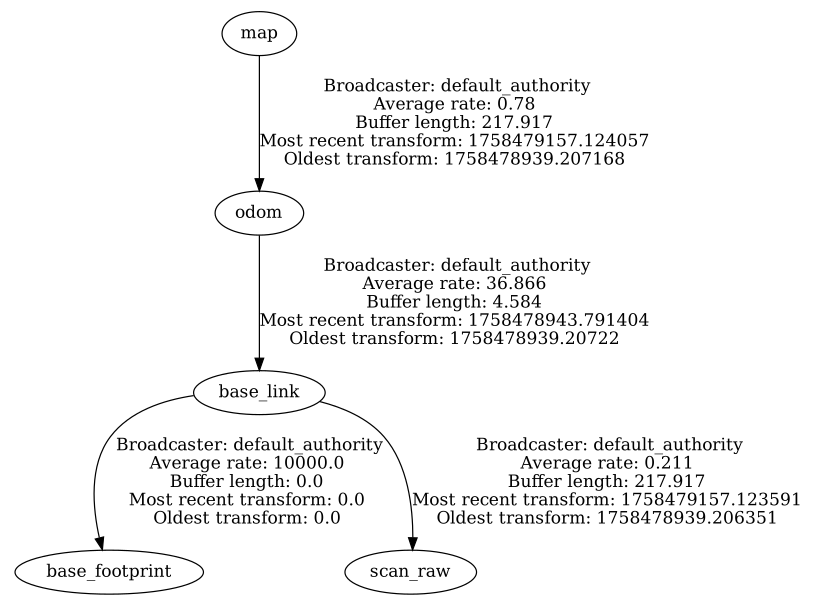

# Robots Móviles curso 25-26
# Práctica 1: Mapeado "simple"

La práctica a desarrollar consiste en implementar un par de algoritmos de mapeado simplificados: 

- El primero de ellos creará un mapa como una nube de puntos global en la que se irán fusionando las lecturas del láser 2D. 
- El segundo será un mapa de *landmarks*, o características distintivas del entorno. 

El título de mapeado "simple" viene de que no vamos a tener en cuenta los errores de la odometría del robot, que en el mundo real generarían mapas con demasiado error para ser útiles salvo que introdujéramos algún mecanismo de corrección.

> El objetivo pedagógico de la práctica es trabajar conceptos como la transformación entre sistemas de coordenadas y el manejo de datos de sensores como los láser 2D. También familiarizarse con la estructura básica de un nodo en ROS y la suscripción/publicación de mensajes.

> Para  ayudaros con las prácticas de la asignatura podéis usar un LLM o chatbot como ChatGPT, Claude, Grok, Gemini,... De hecho **os animo a que lo uséis** ya que son herramientas muy útiles no solo para escribir código en ROS sino también para descubrir métodos, enfoques o algoritmos que no conocíais. Otra cuestión es que no sería muy pedagógico que usárais la IA simplemente para copiar/pegar el enunciado y copiar/pegar el resultado a entregar. Siempre que entendáis lo que habéis conseguido con su ayuda (aunque sea la propia IA la que os lo explique) no habrá problema.

## Entorno simulado

Os dejamos un entorno para el simulador `mvsim`. Para ponerlo en marcha, bajáos el archivo `prac1.world.xml` de Moodle y donde lo hayáis bajado teclear:

```bash
ros2 launch mvsim launch_world.launch.py world_file:=prac1.world.xml
```

Entre otros topics veréis `scan_raw`, que es el láser 2D. El láser simulado tiene 300 lecturas en un campo de visión de 180 grados. 

Tened en cuenta que podéis mover al robot por el entorno con las teclas WASD.

Podéis cambiar cualquier elemento que queráis del mundo simulado para vuestros propios experimentos o si os apetece crear vuestro propio mundo. La [documentación de mvsim](https://mvsimulator.readthedocs.io/en/latest/) no está del todo completa pero os puede servir de ayuda.

## Transformaciones de coordenadas en ROS 2

En cualquier robot móvil hará falta en general más de un sistema de coordenadas. Por ejemplo, sensores como las cámaras 3D o los láseres, cuando detectan información lo hacen en su propio sistema de referencia (los ejes coinciden con la posición física del sensor), pero típicamente no coincidirán con los ejes del cuerpo del robot. Por otro lado, el sistema de referencia del cuerpo del robot se mueve conforme se mueve éste, pero necesitamos también sistemas externos "fijos". Por ejemplo, el sistema de coordenadas de un mapa del entorno.

Esto hace que habitualmente sea necesario transformar coordenadas de un sistema a otro. Por ejemplo, en nuestro caso **necesitamos transformar las coordenadas de los puntos detectados por el láser a coordenadas del mapa**, para poder ir construyéndolo. Afortunadamente ROS nos va a ayudar mucho en esta tarea.

En el [REP (ROS Enhancement Proposal) 105](https://www.ros.org/reps/rep-0105.html) se definen una serie de sistemas de coordenadas estándar para robots móviles. Los que nos interesan de momento son los siguientes:

- `base_link`: El sistema de coordenadas de la plataforma base del robot. Es un sistema local al robot, que se mueve cuando este se mueve. Típicamente se coloca en el centro de rotación del robot.
- `odom`: Este sistema de coordenadas está fijo en el mundo (no se mueve cuando se mueve el robot) y su origen y orientación cero coincide con la posición de partida del robot. Es lo que se conoce habitualmente como *odometría*: conforme el robot se va moviendo también va estimando su posición actual con respecto a este sistema.
- `map`: Es un sistema de coordenadas asociado a un mapa del entorno. Está fijo en el mundo (no se mueve cuando se mueve el robot) y su origen y orientación cero es arbitrario y depende de quien haya creado el mapa. El robot puede estimar su posición con respecto a este sistema comparando el mapa con lo que perciben actualmente los sensores. Esto se conoce como *localización* (lo veremos en la práctica 2).

Además, como usaremos un láser para detectar obstáculos, tendremos un sistema asociado a él. El nombre típico que se le suele dar es `base_laser_link`, y es en el que se obtienen las medidas del láser.

> **IMPORTANTE:** En el mundo simulado que os pasamos, el sistema de coordenadas del láser se llama igual que el topic del láser, `scan_raw`

En ROS 2 hay una herramienta llamada `view_frames` que genera un grafo con todos los sistemas de coordenadas activos en un momento dado y las relaciones entre ellos. Lo obtendremos en un .pdf y también en un formato especial llamado GraphViz (hay visores para Linux) con el siguiente comando:

```bash
ros2 run tf2_tools view_frames
```

Para el mundo simulado de la práctica, el pdf debería mostrar algo como esta figura:



> En el simulador mvsim por defecto se define el sistema de coordenadas "map" coincidiendo exactamente con "odom", así que en este caso "map" no nos sirve de mucho. 

Este grafo se conoce como *grafo de transformaciones*. Que aparezca una arista que va de un nodo A a un nodo B indica que ROS conoce la matriz que transforma el sistema A en el B. Si conocemos la transformación de A a B también tenemos la de B a A, ya que es la matriz inversa, de modo que la dirección del arco no es importante.

En un grafo de transformaciones **podemos calcular la transformación entre dos sistemas cualesquiera A y B siempre que haya un camino entre ambos**, sin importar la dirección de las flechas. 

Aunque parezca antiintuitivo, **la transformación que lleva de un sistema A al sistema B, en realidad nos sirve para pasar puntos dados en el sistema B al sistema A**.

Por ejemplo, supongamos que queremos pasar un punto dado en el sistema `scan_raw` al sistema `odom` y por tanto necesitamos la transformación de `odom` a `scan_raw`. Vemos que hay un camino que une ambos nodos, de modo que podemos pedirle a ROS la transformación, 


```python
import rclpy
from rclpy.node import Node
from geometry_msgs.msg import PointStamped
from tf2_ros import Buffer, TransformListener
from tf2_geometry_msgs import do_transform_point
import tf2_ros

class TFExample(Node):
    def __init__(self):
        super().__init__('tf_example_py')
        self.buffer = Buffer()
        self.listener = TransformListener(self.buffer, self)  # usa el clock del nodo
        self.create_timer(1, self.tick)

    def tick(self):
        try:
            tf = self.buffer.lookup_transform('odom', 'scan_raw', rclpy.time.Time())
            p_in = PointStamped()
            p_in.header.frame_id = 'scan_raw'
            #Pasamos un punto cualquiera, es solo un ejemplo
            p_in.point.x, p_in.point.y, p_in.point.z = 1.0, 0.0, 0.0
            p_out = do_transform_point(p_in, tf)
            print(f'{p_in.point} en scan_raw es {p_out.point} en odom')
        except (tf2_ros.TransformException,) as ex:
            self.get_logger().warn(f'TF2 error: {ex}')

def main():
    rclpy.init()
    node = TFExample()
    rclpy.spin(node)
    rclpy.shutdown()

if __name__ == '__main__':
    main()
```

Tened en cuenta que como "odom" es el único sistema fijo que tenemos (como vimos, en mvsim por defecto "map"=="odom"), debemos guardar las coordenadas de los objetos que compongan el mapa en el sistema "odom" (sean las nubes de puntos o los landmarks).


## Mapas basados en nubes de puntos

Como sabemos, cada "barrido" del láser 2D nos da un *scan* con las distancias a los objetos más cercanos cada cierto número de grados. El objetivo en este apartado es convertir el *scan* en una nube de puntos y acumular la nube actual en una nuble "global".

1. Con trigonometría básica, sabiendo el ángulo al que apunta cada rayo y la distancia detectada, podemos convertir cada $(ángulo, distancia)$ a coordenadas $(x,y)$ en el sistema de referencia del láser.
2. Acumulando todos los puntos del *scan* podemos obtener una nube de puntos "local". En general las nubes de puntos tendrán coordenadas $(x.y.z)$ pero al ser el láser 2D solo tenermos las dos primeras.
3. Convirtiendo la nube de puntos local a un sistema de coordenadas global externo al robot ("map" u "odom") podemos ir acumulando todas las nubes locales en una global.

Pistas para la implementación:

- Las nubes de puntos en ROS se representan con mensajes de tipo `sensor_msgs/msg/PointCloud2`. Se pueden visualizar en RViz con un display de tipo `PointCloud2`.
- Los pasos 1 y 2 los podéis realizar en una sola operación si os ayudáis de la clase `laserProjection`. Investigad su uso. Cuidado: está en el paquete `ros-jazzy-laser-geometry` (o en lugar de `jazzy` la versión que sea). Este paquete debería estar instalado en los laboratorios y la máquina virtual de la asignatura pero si usáis otra distribución aseguráos primero de que lo instaláis.
- Como sistema de coordenadas global y externo al robot os recomiendo que uséis "odom", nos evita el "problema" de dónde fijar el origen de "map".
- Conforme la nube global se vaya haciendo más grande, mantener todos los puntos será ineficiente. Podéis *voxelizar* los puntos, lo que quiere decir dividir el espacio en pequeños cubos y guardar solo un punto por cada uno de ellos (como es un láser 2D en realidad serán cuadrados en el plano, pero es la  misma idea). Investigad el tema.

## Mapas basados en landmarks

Un *landmark* es un lugar o un objeto que se puede distinguir más o menos fácilmente del resto del entorno. Qué consideremos un *landmark* dependerá del tipo de sensor que estemos usando. Por ejemplo para un láser 2D los *landmarks* pueden ser las esquinas de las paredes, ya que son sitios donde la dirección de los puntos detectados cambia bruscamente. Para una cámara pueden ser objetos de un color especial, o códigos QR colocados en las paredes.

En los mundos simulados que os pasamos, los *landmarks* más evidentes son los conos y los contenedores de basura, pero podéis intentar detectar otros como las esquinas de las paredes del fondo. Cada landmark lo podéis reducir simplemente a las coordenadas $(x,y)$ del centro.

pistas para la implementación:

- En ROS 2 los landmarks se pueden representar mediante mensajes del tipo `visualization_msgs/Marker`. En lugar de publicarlos uno a uno podéis publicar un conjunto de *markers*:  creáis cada uno y los añadís todos en un `visualization_msgs/MarkerArray`. En RViz2 se pueden visualizar con un *display* de los mismos nombres (`Marker` si es uno solo o `MarkerArray` si es un conjunto).
- Cuando el robot se vaya moviendo irá detectando varias veces el mismo *landmark*. Solo deberíais considerarlo como nuevo si está "a una distancia suficiente" de cualquier *landmark* detectado hasta el momento. Este parámetro de distancia lo tendréis que fijar experimentalmente.


## Baremo y fecha de entrega

La práctica se debe realizar **de manera individual**.

La fecha límite de entrega será el ~~7 de octubre~~ **14 de octubre a las 23:59 horas**. La entrega se realizará por Moodle.

El baremo de puntuación será el siguiente:

- Hasta 3 puntos: implementar y probar un algoritmo de mapeado basado en nube de puntos sin voxelización
- Hasta 1.5 puntos: implementar voxelización para reducir el coste de mantener la nbe de puntos. Probar en qué medida reduce el coste del algoritmo
- Hasta 3 puntos: implementar y probar un algoritmo de mapeado basado en landmarks para detectar al menos los conos del entorno simulado
- Hasta 1.5 puntos: reconocer algún landmark adicional como las esquinas de las paredes o el contenedor de basura. En ese caso el mapa debería tener distintos tipos de landmarks. Los `Marker` tienen un campo entero llamado `type` que varía cómo los representa gráficamente RViz, los más típicos son 1 (CUBE), 2 (SPHERE) y 3 (CYLINDER). Simplemente usad uno distinto para cada tipo de landmark que detectéis, la forma dibujada es lo de menos.
- Hasta 1 punto: En lugar de mover al robot con el teclado podéis implementar algún algoritmo que haga que se mueva aleatoriamente sin chocar con los obstáculos. En lugar de tomar un solo rayo a la izquierda y otro a la derecha, como en el ejemplo de la sesión anterior podéis ver la media de unas cuantas lecturas del láser a la izquierda y a la derecha del robot y girar en la dirección en que la media sea mayor. O podéis usar cualquier otro enfoque que se os ocurra.

**IMPORTANTE:** se debe incluir una documentación en formato vídeo explicativo  donde se vea el funcionamiento de todos los algoritmos implementados y se describa el código y la estrategia seguida, además de un breve informe en PDF con conclusiones y posibles mejoras. La documentación y pruebas se suponen incluidas en la puntuación de cada apartado (es decir, por ejemplo los 3 puntos del mapeado basado en nube de puntos son no solo por la implementación sino también por las pruebas y la descripción del código).


